# Multi-Source Detection Engineering CI/CD Pipeline

[](https://github.com/jroberts2124/detection-engineering-cicd/actions/workflows/detection-validation.yml)

An end-to-end Detection-as-Code project that collects Windows endpoint telemetry, simulates controlled adversary behavior, correlates activity across multiple log sources, converts Sigma rules to Splunk SPL, packages production content with `contentctl`, and validates every change through GitHub Actions.

## Project highlights

- Built a two-VM security monitoring lab with Splunk Enterprise and a Windows endpoint.
- Forwarded Windows Security, Sysmon, and PowerShell Operational logs using Splunk Universal Forwarder.
- Simulated PowerShell activity mapped to MITRE ATT&CK T1059.001 with Atomic Red Team.
- Generated a controlled failed-logon sequence mapped to MITRE ATT&CK T1110.
- Created Sigma rules for individual behaviors and multi-source correlation.
- Converted Sigma detections into Splunk SPL and validated them against collected telemetry.
- Built a reusable contentctl correlation detection with data sources, drilldowns, metadata, and a filter macro.
- Packaged the detection as a deployable Splunk content pack.
- Implemented CI/CD that validates Sigma, validates contentctl, builds the Splunk application, and uploads the package as a workflow artifact.

## Lab architecture

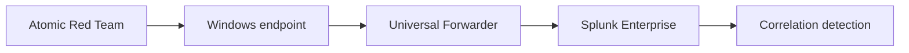

The endpoint produces Windows Security events, Sysmon process-creation events, and PowerShell script-block events. Splunk correlates those sources into one higher-confidence detection.

## Detection scenario

The primary detection identifies a potential compromise chain occurring on the same endpoint within ten minutes:

1. Five or more failed Windows logons (`4625`).
2. A successful Windows logon (`4624`).
3. PowerShell process creation through Sysmon (`Event ID 1`).
4. Suspicious PowerShell script-block activity (`4104`).

The generalized SPL requires all four signal categories and retains useful investigation fields such as users, process images, command lines, first seen, and last seen.

| Data source | Purpose |
| --- | --- |
| Windows Security 4625 | Detect a failed-logon burst |
| Windows Security 4624 | Identify a successful logon following failures |
| Sysmon Event ID 1 | Identify PowerShell process execution |
| PowerShell Event ID 4104 | Detect suspicious script content |

## Detection result

The controlled validation produced five failed logons and all four required signals within 534.8 seconds.

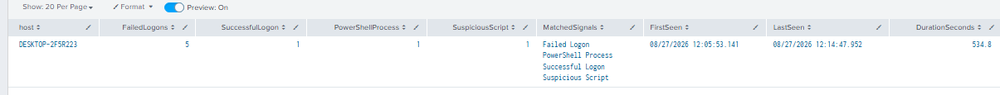

## Evidence

### Telemetry collection

The Splunk Universal Forwarder was verified as active, and a test Windows event confirmed the ingestion path.

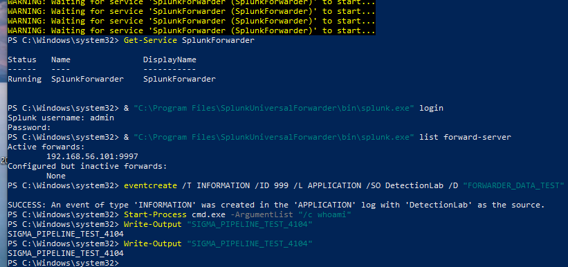

### Controlled attack simulation

Atomic Red Team T1059.001 generated controlled fileless PowerShell activity on the Windows endpoint.

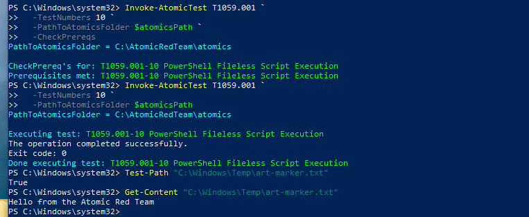

### PowerShell and Sysmon evidence

Splunk captured suspicious PowerShell script-block telemetry and Sysmon process-creation data.

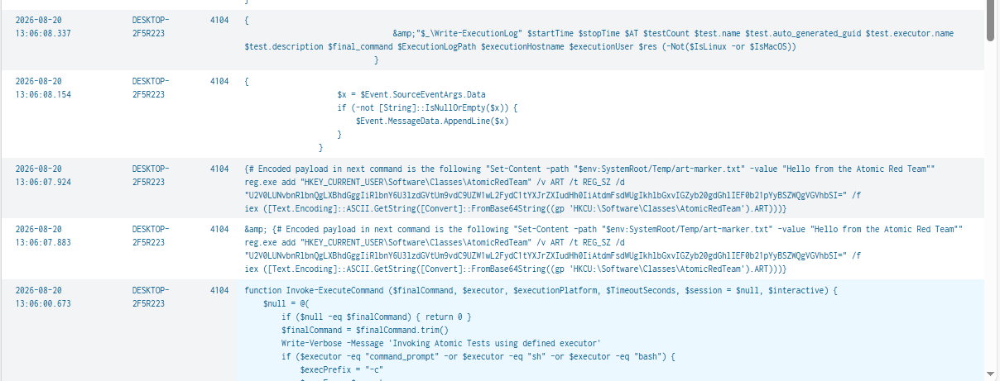

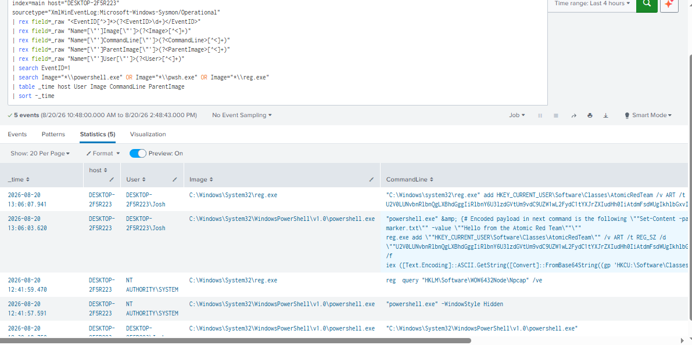

### Brute-force signal

Five failed logons were grouped into a single failed-logon burst.

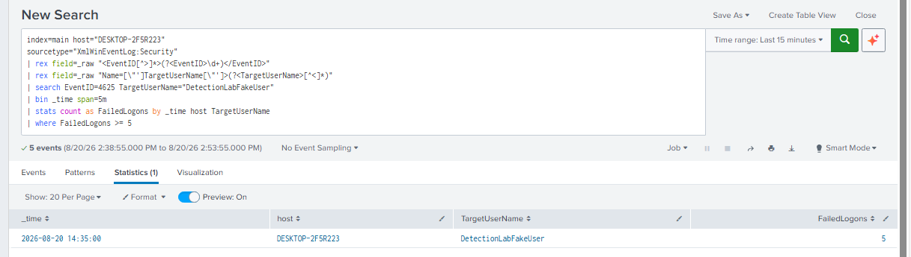

### Sigma validation and conversion

All Sigma rules passed validation, and the multi-source bundle converted successfully to Splunk SPL.

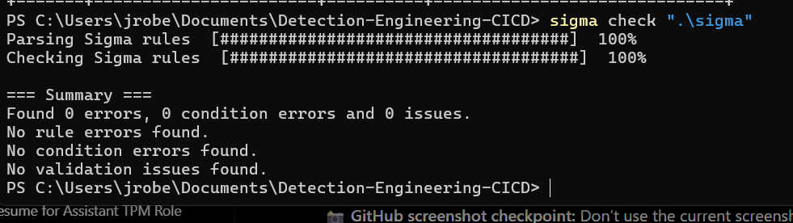

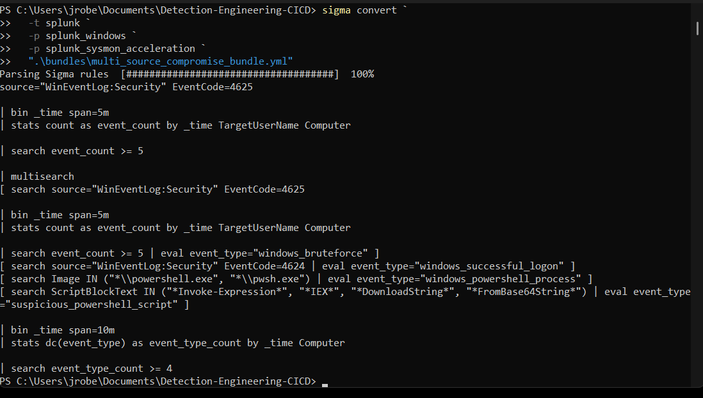

### contentctl validation and packaging

The contentctl project passed validation and produced a deployable Splunk content pack containing the packaged correlation search.

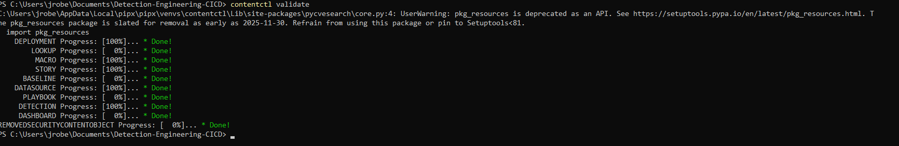

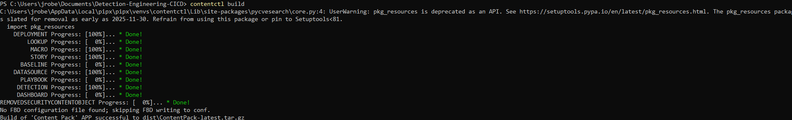

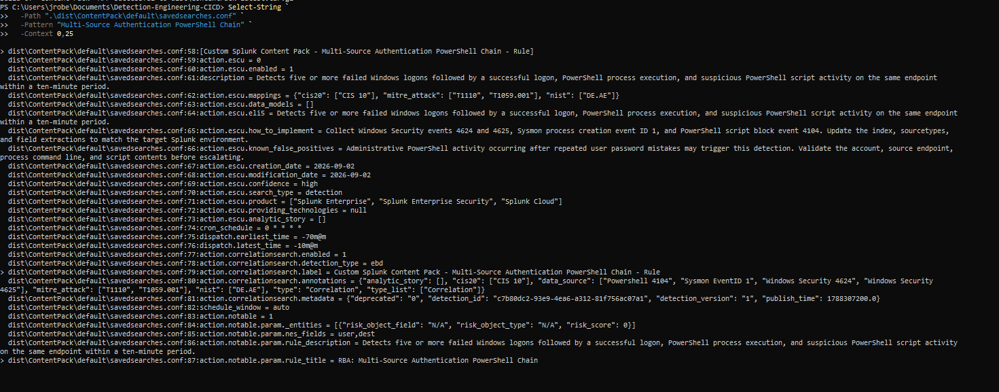

### GitHub Actions CI/CD

Every push and pull request runs automated Sigma validation, contentctl validation, content-pack building, and artifact upload.

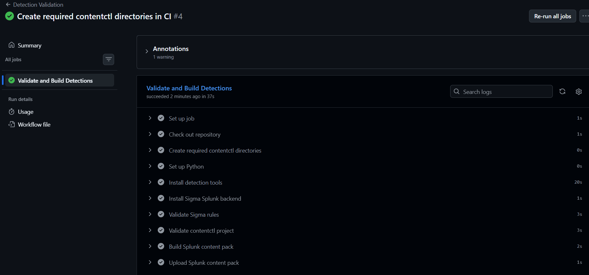

Additional evidence is available in [`docs/screenshots`](docs/screenshots) and documented in [`docs/SCREENSHOT_INDEX.md`](docs/SCREENSHOT_INDEX.md).

## Detection-as-Code workflow

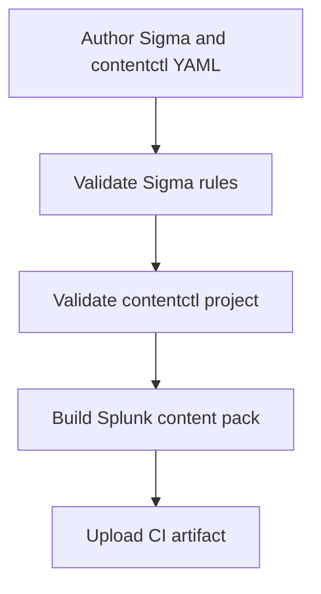

The workflow file is located at [`.github/workflows/detection-validation.yml`](.github/workflows/detection-validation.yml).

## Repository structure

```text
.
|-- .github/workflows/       GitHub Actions pipeline
|-- bundles/                 Multi-document Sigma correlation bundles
|-- data_sources/            contentctl data-source definitions
|-- detections/endpoint/     Production contentctl detection
|-- docs/screenshots/        Validation evidence
|-- macros/                  Splunk filter macros
|-- sigma/                   Base and correlation Sigma rules
|-- spl/custom/              Lab-specific and generalized SPL
|-- spl/generated/           Sigma-generated SPL
|-- contentctl.yml           Content-pack configuration
`-- README.md                Project documentation
```

## Important files

- [`detections/endpoint/multi_source_authentication_powershell_chain.yml`](detections/endpoint/multi_source_authentication_powershell_chain.yml) - Production contentctl correlation detection.
- [`sigma/multi_source_compromise_correlation.yml`](sigma/multi_source_compromise_correlation.yml) - Multi-source Sigma correlation logic.
- [`spl/custom/multi_source_compromise_detection.spl`](spl/custom/multi_source_compromise_detection.spl) - Generalized Splunk detection.
- [`bundles/multi_source_compromise_bundle.yml`](bundles/multi_source_compromise_bundle.yml) - Sigma conversion bundle.
- [`.github/workflows/detection-validation.yml`](.github/workflows/detection-validation.yml) - Automated validation and build workflow.

## Local validation

Prerequisites:

- Python 3.11
- `sigma-cli` with the Splunk backend
- `contentctl`

Run Sigma validation:

```bash
sigma check sigma
```

Validate the contentctl project:

```bash
contentctl validate
```

Build the deployable Splunk package:

```bash
contentctl build
```

The build produces `dist/ContentPack-latest.tar.gz`. The `dist` directory is intentionally excluded from Git because GitHub Actions generates and stores the package as an artifact.

## MITRE ATT&CK coverage

- **T1110 - Brute Force:** repeated failed authentication attempts.
- **T1059.001 - PowerShell:** PowerShell process execution and suspicious script-block behavior.

## Skills demonstrated

- Detection engineering and multi-source event correlation
- Splunk SPL development and investigation workflows
- Windows Security, Sysmon, and PowerShell telemetry analysis
- Sigma rule authoring, validation, bundling, and conversion
- MITRE ATT&CK mapping
- Atomic Red Team adversary simulation
- contentctl validation and Splunk application packaging
- Git, GitHub, and GitHub Actions CI/CD
- Troubleshooting schema, data-source, macro, packaging, and cloud-runner issues

## Safety note

All activity was performed in an isolated lab using controlled test commands. The repository contains detection logic and documentation, not malicious payloads or credentials.
